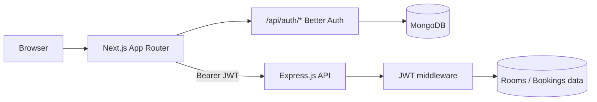

# QuietHub — Where Deep Focus Begins

QuietHub is a calm, minimal study-room marketplace. Hosts list focus spaces; guests browse amenities, compare hourly rates, and book sessions with date-and-time controls. The stack is a **Next.js 16** frontend (Better Auth + MongoDB for sign-in) and an **Express.js** API secured with **JWT** for rooms, bookings, and listings.

---

## Table of Contents

- [Features](#features)
- [Tech Stack](#tech-stack)
- [Project Structure](#project-structure)
- [Prerequisites](#prerequisites)
- [Environment Variables](#environment-variables)
- [Getting Started](#getting-started)
- [Available Scripts](#available-scripts)
- [Routes](#routes)
- [Architecture Overview](#architecture-overview)
- [Challenges Faced](#challenges-faced)
- [Deployment](#deployment)
- [License](#license)

---

## Features

| Area | Capabilities |
|------|----------------|
| **Discovery** | Home showcase of latest rooms, full catalog with search, amenity filters, and hourly-rate range |
| **Room details** | Image gallery, capacity, floor, amenities, owner tools (edit / delete) |
| **Booking** | Modal flow with date picker, start/end hour slots, optional note, live cost estimate |
| **My bookings** | Upcoming vs past sessions; reschedule and cancel actions |
| **Listings** | Add room (multi-step form), manage **My Listings**, inline edit |
| **Auth** | Email/password and Google OAuth via Better Auth; JWT sent to Express on protected API calls |
| **Profile** | Account details and session-aware navigation |
| **UX** | HeroUI components, Motion animations, toast feedback, scroll-to-top, loading and error boundaries |

---

## Tech Stack

| Layer | Technology |
|-------|------------|
| Framework | [Next.js 16](https://nextjs.org) (App Router) |
| UI | [React 19](https://react.dev), [HeroUI](https://www.heroui.com) v3, [Tailwind CSS](https://tailwindcss.com) v4 |
| Motion | [Motion](https://motion.dev) |
| Icons | [React Icons](https://react-icons.github.io/react-icons/) (Remix Icon set) |
| Auth (frontend) | [Better Auth](https://www.better-auth.com) + JWT plugin + `@better-auth/mongo-adapter` |
| Database | [MongoDB](https://www.mongodb.com) (Better Auth users/sessions) |
| Backend API | [Express.js](https://expressjs.com) + JWT (`Authorization: Bearer`) |
| Dates | `@internationalized/date` (booking calendar constraints) |
| Compiler | React Compiler (`babel-plugin-react-compiler`) |
| API base URL | `NEXT_PUBLIC_SERVER_URL` (Express server) |

---

## Project Structure

```
├── public/
├── src/
│   ├── app/
│   │   ├── (auth)/
│   │   │   ├── login/
│   │   │   ├── register/
│   │   │   └── my-profile/
│   │   ├── api/auth/[...all]/
│   │   ├── Components/
│   │   ├── rooms/
│   │   ├── add-room/
│   │   ├── my-bookings/
│   │   ├── my-listings/
│   │   ├── layout.js
│   │   ├── page.js
│   │   ├── globals.css
│   │   ├── loading.js
│   │   └── not-found.js
│   ├── lib/
│   │   ├── auth.js
│   │   ├── auth-client.js
│   │   └── booking-time.js
│   └── proxy.js
├── next.config.mjs
├── postcss.config.mjs
├── jsconfig.json
├── eslint.config.mjs
└── package.json
```

---

## Prerequisites

- **Node.js** 18.18+ (20 LTS recommended)
- **npm**, **pnpm**, **yarn**, or **bun**
- Running **MongoDB** instance (local or Atlas) for Better Auth
- Running **Express.js** API with JWT middleware (rooms, bookings, listings)
- **Google OAuth** credentials (optional, for social sign-in)
- Shared **JWT secret** (or compatible verification) between Better Auth and Express

---

## Environment Variables

Create a `.env.local` in the project root:

| Variable | Required | Description |
|----------|----------|-------------|
| `MONGO_URI` | Yes | MongoDB connection string for Better Auth |
| `BETTER_AUTH_URL` | Yes | Public base URL of this Next app (e.g. `http://localhost:3000`) |
| `BETTER_AUTH_SECRET` | Yes | Secret for signing auth tokens (generate a strong random string) |
| `GOOGLE_CLIENT_ID` | For Google login | OAuth client ID |
| `GOOGLE_CLIENT_SECRET` | For Google login | OAuth client secret |
| `NEXT_PUBLIC_SERVER_URL` | Yes | Base URL of the Express API (no trailing slash) |

Example:

```env
MONGO_URI=mongodb://127.0.0.1:27017/quiethub
BETTER_AUTH_URL=http://localhost:3000
BETTER_AUTH_SECRET=your-long-random-secret
GOOGLE_CLIENT_ID=
GOOGLE_CLIENT_SECRET=
NEXT_PUBLIC_SERVER_URL=http://localhost:5000/api
```

---

## Getting Started

1. **Clone the repository**

   ```bash
   git clone <repository-url>
   cd quietHub-where-deep-focus-begins
   ```

2. **Install dependencies**

   ```bash
   npm install
   ```

3. **Configure environment**

   Copy the variables above into `.env.local` and point `NEXT_PUBLIC_SERVER_URL` at your Express API.

4. **Start the Express API**

   Run your Express server (default example: port `5000`) so public reads and JWT-protected writes succeed.

5. **Run the development server**

   ```bash
   npm run dev
   ```

6. **Open the app**

   Visit [http://localhost:3000](http://localhost:3000).

7. **Production build (optional)**

   ```bash
   npm run build
   npm start
   ```

---

## Available Scripts

| Script | Command | Purpose |
|--------|---------|---------|
| `dev` | `npm run dev` | Start Next.js dev server with HMR |
| `build` | `npm run build` | Production build |
| `start` | `npm start` | Serve production build |
| `lint` | `npm run lint` | Run ESLint |

---

## Routes

| Path | Access | Description |
|------|--------|-------------|
| `/` | Public | Landing, featured rooms, success stories |
| `/rooms` | Public | Searchable room catalog |
| `/rooms/[id]` | Public | Room detail and booking |
| `/login` | Public (redirect if signed in) | Sign in |
| `/register` | Public (redirect if signed in) | Create account |
| `/my-profile` | Protected | User profile |
| `/my-bookings` | Protected | Booking history and actions |
| `/my-listings` | Protected | Host-owned rooms |
| `/add-room` | Protected | Create a new listing |

Protected routes are enforced in `src/proxy.js` via the Next.js proxy matcher.

---

## Architecture Overview



- **Rendering**: Server Components fetch public room data from Express on the home and detail pages; client components handle filters, forms, and booking modals.
- **Sign-in**: Better Auth stores users in MongoDB and issues JWTs via the Better Auth JWT plugin. The Next app reads sessions with `auth.api.getSession` (server) and `authClient` (client).
- **Protected API calls**: Mutations and user-scoped reads attach `Authorization: Bearer <token>` from `auth.api.getToken` or `authClient.token()` before calling Express (bookings, listings, add/edit/delete room).
- **Express**: JWT middleware on the Express server validates the Bearer token on protected routes; public routes (e.g. list rooms) may stay open.
- **Booking rules**: `src/lib/booking-time.js` centralizes hour labels, same-day minimum hours, and disabled end slots so UI and validation stay aligned.
- **Repos**: This package is the Next.js client; the Express + JWT API runs as a separate service at `NEXT_PUBLIC_SERVER_URL`.

---

## Challenges Faced

Development trade-offs and problem areas encountered while building QuietHub:

```
Challenges Faced
│
├── Authentication & Route Protection
│   ├── Better Auth (MongoDB) + JWT plugin on Next; Express verifies same JWT
│   ├── Passing Bearer token from server (`getToken`) vs client (`authClient.token()`)
│   ├── Aligning BETTER_AUTH_URL, cookie cache, and server `getSession` reads
│   ├── Next.js 16 `proxy.js` matcher instead of legacy middleware
│   └── Redirect loops: signed-in users on /login, guests on /my-profile
│
├── Express.js + JWT API
│   ├── Public GET routes vs JWT-guarded POST/PATCH/DELETE
│   ├── CORS and `Authorization` header from browser to Express origin
│   ├── 401 handling when token missing, expired, or secret mismatch
│   └── Owner checks (`creatorId`) enforced on Express after JWT decode
│
├── Split Frontend / API Architecture
│   ├── Room and booking persistence lives on Express, not in this repo
│   ├── Consistent error handling when API returns non-JSON or empty arrays
│   ├── `cache: "no-store"` on SSR fetches vs client refetch on /rooms filters
│   └── Listing pages must fetch token before calling protected endpoints
│
├── Booking Time Domain Logic
│   ├── Same-day bookings must disable past hour slots
│   ├── Start hour must precede end hour; edge case at hour 23
│   ├── `@internationalized/date` timezone vs local `Date` for "today"
│   └── Reschedule flow re-validating constraints after cancel/edit
│
├── Next.js App Router Patterns
│   ├── Mixing Server Components (room detail, metadata) with client islands
│   ├── Async `params` in dynamic `[id]` routes (Next.js 15+ convention)
│   ├── `generateMetadata` fetch failures → fallback "Room Not Found" title
│   └── Dedicated `error.js` / `not-found.js` per segment
│
├── UI & Forms (HeroUI v3)
│   ├── DatePicker + hour `<select>` composition inside booking modal
│   ├── Toast placement and form-level validation feedback
│   ├── Multi-step add-room form with image URL and amenity chips
│   └── Motion + layout stability on responsive hero and carousel
│
├── Images & Configuration
│   ├── Remote room images require `images.remotePatterns` in next.config
│   ├── `unoptimized` flag where CDN/host patterns are broad (`***`)
│   └── React Compiler enabled alongside client-heavy pages
│
└── Developer Experience
    ├── Path alias `@/*` → `src/*` across app and components
    ├── ESLint 9 flat config with `eslint-config-next`
    └── Env-dependent auth: graceful degrade when `MONGO_URI` is unset locally
```

---

## Deployment

**Vercel (recommended)**

1. Import the repository into [Vercel](https://vercel.com).
2. Set all [environment variables](#environment-variables) for Production and Preview.
3. Ensure `BETTER_AUTH_URL` matches the deployed origin (e.g. `https://your-app.vercel.app`).
4. Allow your OAuth redirect URIs in Google Cloud Console for production domains.
5. Deploy; `npm run build` runs automatically.

**Self-hosted**

Run `npm run build` then `npm start` behind a reverse proxy with HTTPS. Deploy the Express API separately; set `BETTER_AUTH_URL`, `NEXT_PUBLIC_SERVER_URL`, and Express CORS/JWT settings to match production domains.

---

## License

This project is private (`"private": true` in `package.json`). Add a license file and terms before open-sourcing or redistribution.

---

**QuietHub** — calm, minimal, intentional spaces for deep focus.
